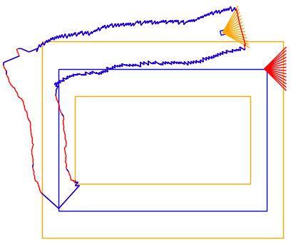
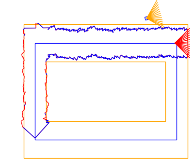

<!-- $theme: default -->

# 
Pose-graph-based representation for exploration

# 
-

# 
current project state

---
<!-- page_number: true -->
# Motivation

 * Most current exploration methods are based on grid-based representations
 * These representations assume a perfect state estimate
 * Not realistic for visual(-inertial) odometry, which produces a pose-graph exhibiting drift
 * We seek a pose-graph-based representation for exploration

---

# Frontier-based exploration

 * Represent map as obstacles and frontiers
   * A frontier is the border between known / unknown space
 * Exploration is finished when there are no more frontiers
 * Robots have to share frontiers and the information how to go there

---

# Approach - Mesh / Polygon

* Edges represent frontiers or obstacles
* Free space is inside the polygon

---

# Why is this better than a grid?

 * Naturally deformable with the pose graph

---

# Active area

 * The active area is a local area within which the drift is small
 * Polygons within the active area are related
   * Overlapping polygons only get merged if they are in an active area
 * This prevents merging of unrelated polygons
   * Good for noisy estimates

<!--

-->

---

# Active area

 * This prevents merging of unrelated polygons
   * Good for noisy estimates

---

# How to merge if it should actuallly overlap?

 * Merge polygon if SLAM system detected a loop closure:
   * Correct polygon according the corrected pose graph
   * Merge active areas
   * Merge polygons
 
 https://youtu.be/br5jlRJMpD0

<!--

-->