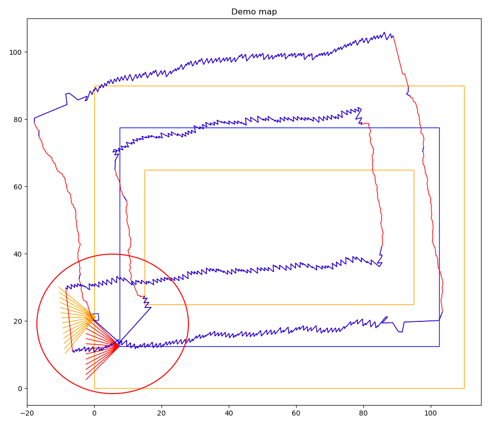
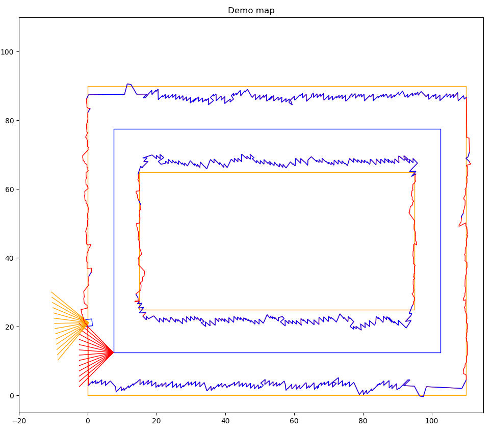

<!-- $theme: default -->

# Minimal Representation for Decentralized Exploration

---
<!-- page_number: true -->
# Motivation

 * Exploring and area with multiple robots to decrease the time needed
 * Minimal representation to ease the exchange of information between robot
 * A good minimal representation could simplify the exploration task

---

# Idea

 * Represent map as obstacles and frontiers
   * A frontier is the border between known- and unknows space
 * Exploration is finished when there are no more frontiers
 * Robots have to share frontiers and the information how to go there

---

# Approach

 * Use meshes (Polygons in 2D) with frontiers and obstacles
 * Merge existing polygon with the polygon from the frustum
   * Find polygon intersections
   * Only consider intersections with the polygon within an active area
 * Correct and merge polygon after a loop closure

---

# So far

 * Literature review
 * Created a 2D proof of concept
 * Plans to go 3D

---

# 2D proof of concept

 * Use orientation of the polygons and the cross product to determine point order for merging

existing polygon, new polygon, resulting polygon

---

# 2D proof of concept

 * Only merge polygons within an active area to prevent wrong maps due to drift

---

# 2D proof of concept

 * Merge polygon if SLAM system detected a loop closure
 * Correct polygon according the corrected pose graph
 * Merge active areas

